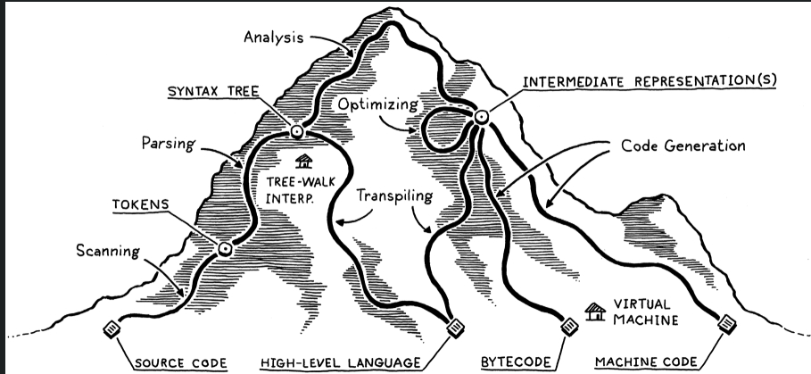

## Crafting Interpreters

This is my notes and sample code to build an interpreter and compiler from scratch inspired by the book "Crafting Interpreters" writter by "Robert Nystrom"

Part 1 of the book builds a Tree-Walk interpreter using Java for a language called "Lox". 
It also discusses the basic building blocks that make up an interpreter/compiler. 
The basic structure or steps that takes to build this is beautifully explained by this diagram below:

### 1. Scanning
The first step in any compiler or interpreter is scanning. The scanner takes in raw source code as a series of characters and groups it into a series of chunks we call tokens. These are the meaningful “words” and “punctuation” that make up the language’s grammar.

This task has been variously called “scanning” and “lexing” (short for “lexical analysis”) over the years. Way back when computers were as big as Winnebagos but had less memory than your watch, some people used “scanner” only to refer to the piece of code that dealt with reading raw source code characters from disk and buffering them in memory. Then “lexing” was the subsequent phase that did useful stuff with the characters.

These days, reading a source file into memory is trivial, so it’s rarely a distinct phase in the compiler. Because of that, the two terms are basically interchangeable.

Scanning is a good starting point for us too because the code isn’t very hard—pretty much a switch statement with delusions of grandeur. It will help us warm up before we tackle some of the more interesting material later. By the end of this chapter, we’ll have a full-featured, fast scanner that can take any string of Lox source code and produce the tokens that we’ll feed into the parser in the next chapter.

### 2. Representing Code
The next step is to transform these tokens into a richer, structured representation—commonly a syntax tree.

Code as a Tree:

A tree structure naturally represents code, capturing its grammatical structure and operator precedence. For example, evaluating 1 + 2 * 3 - 4 requires understanding operator precedence, visualized as a tree where leaves are numbers and interior nodes are operators.
Tree traversal (post-order) enables evaluation, starting from the leaves and working toward the root.
Alternative Representations:

While trees are intuitive, other representations like bytecode are more machine-oriented and less human-readable.
Context-Free Grammars (CFGs):

To define this structured representation, context-free grammars (CFGs) are used, offering more power than regular grammars (used for tokenization) to handle nested expressions.
CFGs define rules to group tokens into syntactic structures, enabling the parser to understand the deeper, hierarchical relationships in the code.
The chapter integrates formal grammar theory, programming paradigms (functional vs. object-oriented), design patterns, and metaprogramming while building toward a structured code representation. This groundwork prepares for writing parsers and interpreters.
Using our handy dandy new notation, here’s a grammar for those:

expression     → literal
| unary
| binary
| grouping ;

literal        → NUMBER | STRING | "true" | "false" | "nil" ;

grouping       → "(" expression ")" ;

unary          → ( "-" | "!" ) expression ;

binary         → expression operator expression ;

operator       → "==" | "!=" | "<" | "<=" | ">" | ">="
| "+"  | "-"  | "*" | "/" ;

### 3. Parsing Expressions
